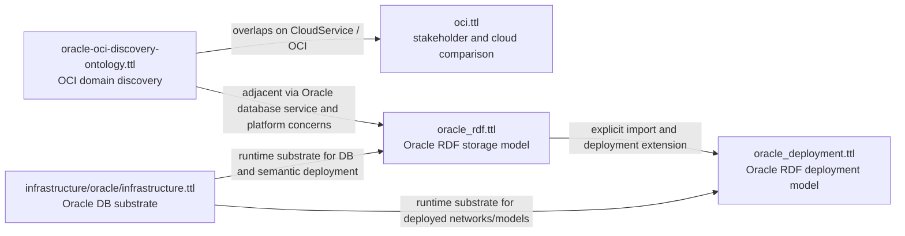

# Oracle Discovery And Adjacency Map

## Scope

This map pulls together the Oracle-related ontology artifacts currently on the
desk in this repository and shows how they relate, where they overlap, and what
is still missing.

## Included Artifacts

### Discovery Core

- [oracle-oci-discovery-ontology.ttl](/Volumes/lemon/gemini/ontology-framework/oracle-oci-discovery-ontology.ttl)

Role:
- primary Oracle/OCI discovery ontology
- models OCI services, learning resources, skills, certifications, and learning
  paths

Key signal:
- this is the closest thing to an Oracle domain discovery ontology in the repo

### Market And Stakeholder Adjacency

- [oci.ttl](/Volumes/lemon/gemini/ontology-framework/oci.ttl)

Role:
- stakeholder and comparative cloud-positioning ontology
- maps personas and stakeholder preferences across OCI, AWS, Azure, and GCP

Key signal:
- this is not infrastructure discovery
- it overlaps with OCI service identity and cloud categorization

### Semantic Storage Adjacency

- [oracle_rdf.ttl](/Volumes/lemon/gemini/ontology-framework/oracle_rdf.ttl)

Role:
- Oracle RDF storage ontology
- models RDF models, tables, columns, staging tables, loading operations,
  procedures, error types, and SHACL constraints

Key signal:
- this is the semantic data-plane side of Oracle, not OCI service discovery

### Deployment Adjacency

- [oracle_deployment.ttl](/Volumes/lemon/gemini/ontology-framework/oracle_deployment.ttl)

Role:
- deployment/process ontology for Oracle RDF artifacts
- explicitly imports `oracle_rdf.ttl`

Key signal:
- this is the operational bridge from transformed ontology files into deployed
  Oracle semantic models

### Infrastructure Adjacency

- [infrastructure/oracle/infrastructure.ttl](/Volumes/lemon/gemini/ontology-framework/infrastructure/oracle/infrastructure.ttl)

Role:
- low-level Oracle database infrastructure ontology
- models database endpoint, port, service name, user, password, and tablespace

Key signal:
- this is the runtime substrate beneath Oracle RDF deployment and operation

## Relationship Map

## Overlaps

### `oracle-oci-discovery-ontology.ttl` and `oci.ttl`

Overlap:
- both talk about OCI as a cloud service
- both use cloud service categorization language
- both are concerned with what OCI is and why it matters

Difference:
- `oracle-oci-discovery-ontology.ttl` is internal domain structure
- `oci.ttl` is external positioning and stakeholder preference analysis

Practical merge point:
- one shared concept for `OCI` or `CloudService`
- stakeholder-facing properties should remain outside the discovery core

### `oracle_rdf.ttl` and `oracle_deployment.ttl`

Overlap:
- both model Oracle semantic/RDF operation
- both care about model identity, validation, and deployment correctness

Difference:
- `oracle_rdf.ttl` models storage semantics, procedures, constraints, and test
  cases
- `oracle_deployment.ttl` models deployment artifacts, schema-private networks,
  and transformed-source lineage

Practical merge point:
- these already form a layered pair
- deployment should stay dependent on RDF storage, not the other way around

### `oracle_rdf.ttl` and `infrastructure/oracle/infrastructure.ttl`

Overlap:
- both are operational Oracle ontologies
- both support validation and runtime correctness

Difference:
- `oracle_rdf.ttl` models semantic storage behavior
- `infrastructure.ttl` models database connectivity and database resources

Practical merge point:
- infrastructure should provide the substrate classes that deployment and RDF
  storage can point to later

## Non-Overlaps

These files are adjacent but not the same layer:

- `oracle-oci-discovery-ontology.ttl` is about cloud domain discovery and
  learning structure
- `oracle_rdf.ttl` is about semantic storage and Oracle-specific RDF handling
- `infrastructure/oracle/infrastructure.ttl` is about database configuration

They should not be flattened into one ontology.

## Missing Layers

The repo does not currently show a meaningful Oracle SaaS business-app ontology
for:

- Fusion Applications
- ERP
- HCM
- SCM
- CX
- EBS

That means the current Oracle coverage is strong in:

- OCI discovery
- Oracle semantic infrastructure
- Oracle deployment/runtime concerns

But weak in:

- Oracle enterprise application domain models
- business capability mapping
- SaaS product-line ontology

## Recommended Consolidation

Keep the set as a stack, not a merge:

1. Discovery layer:
   - `oracle-oci-discovery-ontology.ttl`
2. Comparative/stakeholder layer:
   - `oci.ttl`
3. Semantic platform layer:
   - `oracle_rdf.ttl`
4. Deployment layer:
   - `oracle_deployment.ttl`
5. Runtime infrastructure layer:
   - `infrastructure/oracle/infrastructure.ttl`

## Most Important Immediate Gap

What is missing is a single bridge ontology that links:

- OCI services
- Oracle database / RDF runtime
- deployment targets
- stakeholder or operating concerns

That bridge would let the repo say, in one model, how Oracle cloud services,
semantic infrastructure, deployment processes, and operational stakeholders fit
together without collapsing their layers.
